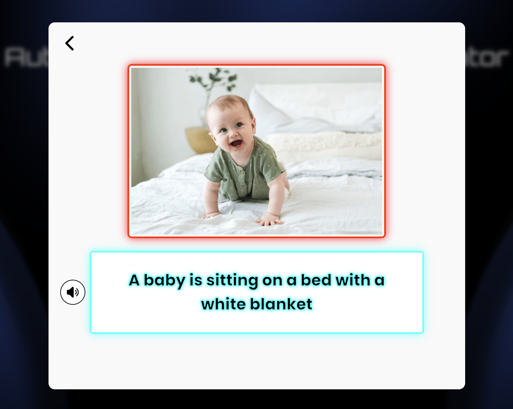
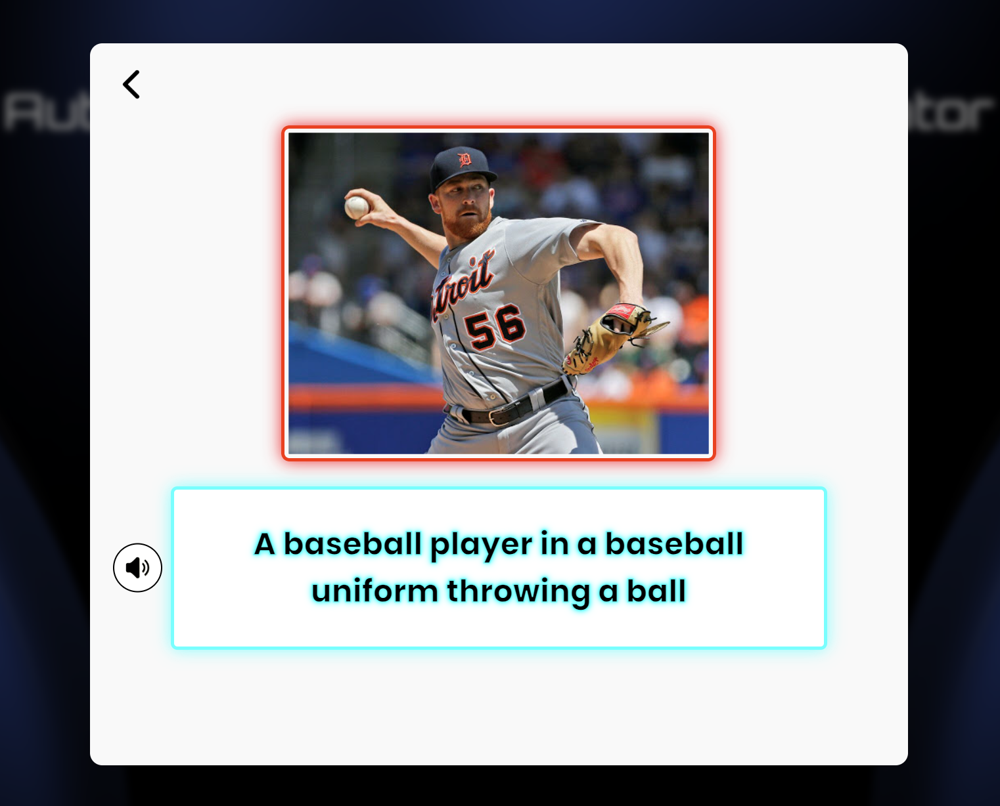
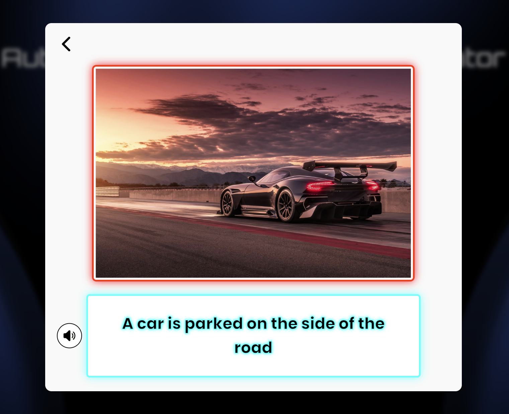

# 🖼️ Automated Image Caption Generator

**An end-to-end deep learning project that generates human-like captions for any given image using an Encoder-Decoder architecture and serves it via a web interface built with Flask.**

---

## 🧠 What is Image Captioning?

Image captioning is the task of generating a **natural language description** for an image. It combines the power of **Computer Vision** and **Natural Language Processing**, enabling machines to understand and describe visual content — just like a human.

This project implements a high-performance captioning model and deploys it as a fully functional **web app**.

---

## 🚀 Project Highlights

- 📸 Generates accurate, context-aware captions for any image
- ✨ Built using an **Encoder-Decoder** architecture  
- 🧪 Evaluated using BLEU (1–4), ROUGE, and CIDEr metrics  
- 🌐 Model deployed on a responsive web interface via **Flask**

---

## 🏗️ Model Architecture

The image caption generator follows an **Encoder-Decoder** pipeline:

- **Encoder**:  
  Pretrained **EfficientNetB5** extracts dense feature vectors from input images.
  
- **Decoder**:  
  A **Transformer-based decoder** takes these features and generates captions word-by-word using learned language patterns.

This combination captures both **visual semantics** and **linguistic context**, making the captions more accurate and fluent.

---

## 📊 Evaluation Metrics

| Metric        | Score    |
|---------------|----------|
| BLEU-1        | XX.XX    |
| BLEU-2        | XX.XX    |
| BLEU-3        | XX.XX    |
| BLEU-4        | XX.XX    |
| ROUGE-L       | XX.XX    |
| CIDEr         | XXX.XX   |

---

## 🌐 Project UI Screens

### 🖥️ Landing Page

  
  
  
  

### 🧾 Caption Generation Page

  

---

## 🖼️ Caption Outputs (Sample Results)

  
  
  
  

---

## 🚫 Note

> This project is shared for **demonstration purposes only**.  
> Model files and setup instructions are intentionally excluded.

---

## 📝 License

This project is licensed under the [MIT License](LICENSE).
